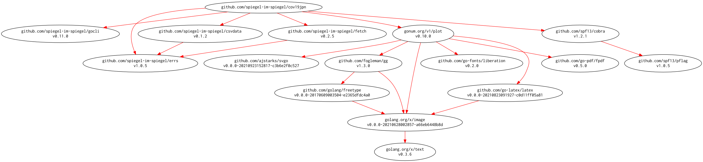

# [cov19jpn] -- COVID-2019 in Japan; Importing Google COVID-19 Public Forecasts

[](https://github.com/spiegel-im-spiegel/cov19jpn/actions)
[](https://github.com/spiegel-im-spiegel/cov19jpn/actions)
[](https://raw.githubusercontent.com/spiegel-im-spiegel/cov19jpn/master/LICENSE)
[](https://github.com/spiegel-im-spiegel/cov19jpn/releases/latest)

## Download and Build

```
$ go install github.com/spiegel-im-spiegel/cov19jpn@latest
```

## Binaries

See [latest release](https://github.com/spiegel-im-spiegel/cov19jpn/releases/latest).

## Usage

```
$ cov19jpn -h
Plotting COVID-2019 in Japan
Importing Google COVID-19 Public Forecasts

Usage:
  cov19jpn [flags]
  cov19jpn [command]

Available Commands:
  csv         Output text formatting CSV
  help        Help about any command
  plot        Output chart images
  version     Print the version number

Flags:
      --debug   for debug
  -h, --help    help for cov19jpn

Use "cov19jpn [command] --help" for more information about a command.
```

### Output Google COVID-19 Public Forecasts Data, formatting CSV

```
$ cov19jpn csv -h
Output text formatting CSV.

Usage:
  cov19jpn csv [flags] [pref name [pref name]...]

Aliases:
  csv, c

Flags:
  -h, --help            help for csv
  -o, --output string   path of CSV file

Global Flags:
      --debug   for debug

$ cov19jpn csv shimane
japan_prefecture_code,prefecture_name,target_prediction_date,cumulative_confirmed,cumulative_confirmed_q0025,cumulative_confirmed_q0975,cumulative_deaths,cumulative_deaths_q0025,cumulative_deaths_q0975,hospitalized_patients,hospitalized_patients_q0025,hospitalized_patients_q0975,recovered,recovered_q0025,recovered_q0975,cumulative_confirmed_ground_truth,cumulative_deaths_ground_truth,hospitalized_patients_ground_truth,recovered_ground_truth,forecast_date,new_deaths,new_confirmed,new_deaths_ground_truth,new_confirmed_ground_truth,prefecture_name_kanji
JP-32,SHIMANE,2021-01-15,,,,,,,,,,,,,233,0,20,213,2021-02-11,,,,,島根県
JP-32,SHIMANE,2021-01-16,,,,,,,,,,,,,234,0,15,219,2021-02-11,,,0,1,島根県
JP-32,SHIMANE,2021-01-17,,,,,,,,,,,,,235,0,14,221,2021-02-11,,,0,1,島根県
JP-32,SHIMANE,2021-01-18,,,,,,,,,,,,,235,0,16,219,2021-02-11,,,0,0,島根県
JP-32,SHIMANE,2021-01-19,,,,,,,,,,,,,237,0,14,223,2021-02-11,,,0,2,島根県
JP-32,SHIMANE,2021-01-20,,,,,,,,,,,,,239,0,15,224,2021-02-11,,,0,2,島根県
JP-32,SHIMANE,2021-01-21,,,,,,,,,,,,,242,0,15,227,2021-02-11,,,0,3,島根県
JP-32,SHIMANE,2021-01-22,,,,,,,,,,,,,242,0,14,228,2021-02-11,,,0,0,島根県
JP-32,SHIMANE,2021-01-23,,,,,,,,,,,,,242,0,12,230,2021-02-11,,,0,0,島根県
JP-32,SHIMANE,2021-01-24,,,,,,,,,,,,,242,0,11,231,2021-02-11,,,0,0,島根県
JP-32,SHIMANE,2021-01-25,,,,,,,,,,,,,242,0,10,232,2021-02-11,,,0,0,島根県
JP-32,SHIMANE,2021-01-26,,,,,,,,,,,,,245,0,8,237,2021-02-11,,,0,3,島根県
JP-32,SHIMANE,2021-01-27,,,,,,,,,,,,,250,0,11,239,2021-02-11,,,0,5,島根県
JP-32,SHIMANE,2021-01-28,,,,,,,,,,,,,254,0,13,241,2021-02-11,,,0,4,島根県
JP-32,SHIMANE,2021-01-29,,,,,,,,,,,,,264,0,16,248,2021-02-11,,,0,10,島根県
JP-32,SHIMANE,2021-01-30,,,,,,,,,,,,,265,0,25,240,2021-02-11,,,0,1,島根県
JP-32,SHIMANE,2021-01-31,,,,,,,,,,,,,268,0,,,2021-02-11,,,0,3,島根県
JP-32,SHIMANE,2021-02-01,,,,,,,,,,,,,269,0,,,2021-02-11,,,0,1,島根県
JP-32,SHIMANE,2021-02-02,,,,,,,,,,,,,271,0,,,2021-02-11,,,0,2,島根県
JP-32,SHIMANE,2021-02-03,,,,,,,,,,,,,273,0,,,2021-02-11,,,0,2,島根県
JP-32,SHIMANE,2021-02-04,,,,,,,,,,,,,273,0,,,2021-02-11,,,0,0,島根県
JP-32,SHIMANE,2021-02-05,,,,,,,,,,,,,274,0,,,2021-02-11,,,0,1,島根県
JP-32,SHIMANE,2021-02-06,,,,,,,,,,,,,276,0,,,2021-02-11,,,0,2,島根県
JP-32,SHIMANE,2021-02-07,,,,,,,,,,,,,276,0,,,2021-02-11,,,0,0,島根県
JP-32,SHIMANE,2021-02-08,,,,,,,,,,,,,276,0,,,2021-02-11,,,0,0,島根県
JP-32,SHIMANE,2021-02-09,,,,,,,,,,,,,278,0,,,2021-02-11,,,0,2,島根県
JP-32,SHIMANE,2021-02-10,,,,,,,,,,,,,278,0,,,2021-02-11,,,0,0,島根県
JP-32,SHIMANE,2021-02-11,,,,,,,,,,,,,280,0,,,2021-02-11,,,0,2,島根県
JP-32,SHIMANE,2021-02-12,281.4327392578,280.4200134277,285.5775146484,0.0573412292,0.057108067,0.0597181059,25.4223861694,25.3036384583,26.3464832306,253.2672271729,252.4028167725,256.2145385742,,,,,2021-02-11,0.0573412292,1.4327392577999944,,,島根県
JP-32,SHIMANE,2021-02-13,282.8598327637,280.9267578125,290.8520812988,0.1151901558,0.1142949611,0.1246879101,25.7711544037,25.5424499512,27.5564861298,254.300201416,252.6523742676,259.985534668,,,,,2021-02-11,0.057848926599999996,1.427093505900018,,,島根県
JP-32,SHIMANE,2021-02-14,284.3745422363,281.6001586914,295.8199768066,0.177356109,0.1753837615,0.1986555159,25.96900177,25.639957428,28.5340805054,255.4936523438,253.1314849854,263.6058959961,,,,,2021-02-11,0.062165953200000013,1.514709472599975,,,島根県
JP-32,SHIMANE,2021-02-15,285.8248596191,282.285736084,300.3962402344,0.2427975982,0.2393651456,0.2802335918,26.0431728363,25.6241340637,29.3071975708,256.8038635254,253.7903289795,267.1263427734,,,,,2021-02-11,0.06544148919999998,1.4503173827999944,,,島根県
JP-32,SHIMANE,2021-02-16,287.4191894531,283.1793518066,304.9180603027,0.310636729,0.3054026961,0.368070364,26.0730133057,25.5733547211,29.966293335,258.2001342773,254.5926055908,270.5791625977,,,,,2021-02-11,0.067839130800000008,1.5943298340000069,,,島根県
JP-32,SHIMANE,2021-02-17,289.0102539062,284.1313781738,309.1745605469,0.380515933,0.3731766343,0.4613147974,26.0624637604,25.4910488129,30.5159797668,259.6674499512,255.5166625977,273.9300231934,,,,,2021-02-11,0.069879203999999973,1.5910644530999889,,,島根県
JP-32,SHIMANE,2021-02-18,291.087890625,285.6035461426,313.8982543945,0.4517800808,0.4420768619,0.5587688684,26.1711006165,25.5322666168,31.1524848938,261.1914672852,256.5433959961,277.1950073242,,,,,2021-02-11,0.071264147800000011,2.0776367188000222,,,島根県
JP-32,SHIMANE,2021-02-19,292.5987854004,286.5892028809,317.5665283203,0.5260644555,0.5137311816,0.6620681286,26.1149463654,25.4192829132,31.5416107178,262.8272094727,257.7218017578,280.4389038086,,,,,2021-02-11,0.074284374700000044,1.5108947754000042,,,島根県
JP-32,SHIMANE,2021-02-20,294.1276550293,287.6348876953,321.0009460449,0.6009882689,0.5858341455,0.7678085566,26.0237731934,25.2782669067,31.8345603943,264.4528503418,258.926574707,283.4698791504,,,,,2021-02-11,0.074923813399999983,1.5288696288999972,,,島根県
JP-32,SHIMANE,2021-02-21,295.4932250977,288.5665588379,324.0433654785,0.6717320681,0.6537263989,0.8694810271,25.992149353,25.2006053925,32.1579360962,265.9428710938,260.0331726074,286.2398376465,,,,,2021-02-11,0.070743799199999957,1.365570068400018,,,島根県
JP-32,SHIMANE,2021-02-22,296.6863708496,289.3720092773,326.6950378418,0.7401368618,0.7192415595,0.9690023065,25.9291114807,25.0973491669,32.4050216675,267.3532104492,261.0933837891,288.8204040527,,,,,2021-02-11,0.068404793700000077,1.1931457518999764,,,島根県
JP-32,SHIMANE,2021-02-23,297.9337158203,290.2584228516,329.2716369629,0.8067853451,0.7829717994,1.0667381287,25.8637638092,24.9961166382,32.6119308472,268.7056884766,262.1247558594,291.1920471191,,,,,2021-02-11,0.06664848329999995,1.2473449706999986,,,島根県
JP-32,SHIMANE,2021-02-24,299.140045166,291.1361999512,331.6831970215,0.8721982837,0.8454474211,1.1632255316,25.7889938354,24.8897743225,32.7767601013,270.0177307129,263.1429138184,293.4386901855,,,,,2021-02-11,0.06541293859999997,1.2063293456999986,,,島根県
JP-32,SHIMANE,2021-02-25,300.7114562988,292.3819274902,334.6558227539,0.9364003539,0.9067112803,1.2584495544,25.8309650421,24.8997135162,33.0677490234,271.2991638184,264.1563720703,295.6364746094,,,,,2021-02-11,0.064202070200000017,1.5714111327999944,,,島根県
JP-32,SHIMANE,2021-02-26,301.8358764648,293.2406616211,336.7730407715,1.0011416674,0.9684699178,1.3545483351,25.7564296722,24.8004722595,33.1862297058,272.6176147461,265.2274475098,297.8098754883,,,,,2021-02-11,0.064741313500000008,1.1244201659999931,,,島根県
JP-32,SHIMANE,2021-02-27,302.9731750488,294.1330566406,338.9406433105,1.0649073124,1.02926898,1.4495714903,25.6864891052,24.7087650299,33.2934837341,273.8716430664,266.2569885254,299.925567627,,,,,2021-02-11,0.063765644999999926,1.1372985840000069,,,島根県
JP-32,SHIMANE,2021-02-28,304.0851135254,295.0232543945,341.1091308594,1.1277914047,1.08921206,1.543636322,25.5903911591,24.5947952271,33.3528404236,275.1045532227,267.2857666016,302.0582885742,,,,,2021-02-11,0.062884092300000027,1.1119384766000167,,,島根県
JP-32,SHIMANE,2021-03-01,305.1078491211,295.1213684082,343.6653137207,1.190125227,1.145883441,1.6382442713,25.4495601654,24.3788986206,33.3700942993,276.3222045898,267.6578369141,304.681854248,,,,,2021-02-11,0.062333822300000064,1.0227355956999986,,,島根県
JP-32,SHIMANE,2021-03-02,306.2182617188,294.6956481934,346.8321228027,1.2518744469,1.1992727518,1.7332940102,25.311340332,24.1170883179,33.4025115967,277.5241394043,267.4669799805,307.719329834,,,,,2021-02-11,0.061749219900000041,1.1104125977000194,,,島根県
JP-32,SHIMANE,2021-03-03,307.3181762695,293.7491760254,350.362487793,1.3131680489,1.2495589256,1.828902483,25.1762828827,23.8188304901,33.4472846985,278.7143554688,266.7992248535,311.1146240234,,,,,2021-02-11,0.061293601999999892,1.0999145506999639,,,島根県
JP-32,SHIMANE,2021-03-04,308.7825317383,292.6889038086,354.7569274902,1.3738151789,1.2965967655,1.9245544672,25.165063858,23.6039581299,33.6588363647,279.8944091797,265.7182006836,314.7361450195,,,,,2021-02-11,0.060647129999999994,1.4643554688000222,,,島根県
JP-32,SHIMANE,2021-03-05,309.8371276855,290.8999023438,358.6539001465,1.4353209734,1.341932416,2.0224831104,25.0548648834,23.2695293427,33.7423286438,281.1234741211,264.3508300781,318.6694030762,,,,,2021-02-11,0.061505794500000155,1.0545959471999709,,,島根県
JP-32,SHIMANE,2021-03-06,310.9117126465,288.8119812012,362.7794494629,1.4961563349,1.3841685057,2.120326519,24.9601974487,22.9279880524,33.8451080322,282.2999267578,262.6442871094,322.7070922852,,,,,2021-02-11,0.060835361499999907,1.0745849610000278,,,島根県
JP-32,SHIMANE,2021-03-07,311.9678039551,286.4402160645,366.993560791,1.5563451052,1.4234162569,2.2180013657,24.8484191895,22.5535488129,33.9207496643,283.4634094238,260.6792907715,326.8406982422,,,,,2021-02-11,0.060188770299999916,1.0560913086000028,,,島根県
JP-32,SHIMANE,2021-03-08,312.942779541,284.3111572266,370.7913513184,1.6161497831,1.4627349377,2.3147313595,24.6993293762,22.1750621796,33.9203872681,284.6180725098,258.9866027832,330.7033691406,,,,,2021-02-11,0.0598046779000001,0.97497558589998334,,,島根県
JP-32,SHIMANE,2021-03-09,314.0048522949,282.5394592285,374.502166748,1.6755055189,1.5020935535,2.4104170799,24.5566291809,21.8293609619,33.9061965942,285.762298584,257.5385742188,334.3199462891,,,,,2021-02-11,0.059355735800000087,1.0620727538999972,,,島根県
JP-32,SHIMANE,2021-03-10,315.0593261719,281.0180358887,377.9692382812,1.7345061302,1.5415933132,2.5051908493,24.4197692871,21.5129928589,33.879989624,286.8987731934,256.313873291,337.7169799805,,,,,2021-02-11,0.059000611299999894,1.0544738770000208,,,島根県
JP-32,SHIMANE,2021-03-11,316.4676513672,280.0232849121,381.8492126465,1.7929475307,1.5810601711,2.5987503529,24.404504776,21.3244171143,34.0051994324,288.0281982422,255.2907562256,340.9142150879,,,,,2021-02-11,0.058441400500000018,1.4083251952999944,,,島根県
```

### Output Bar Chart Images

```
$ cov19jpn plot -h
Output chart images.

Usage:
  cov19jpn plot [flags] [pref name [pref name]...]

Aliases:
  plot, p

Flags:
  -h, --help            help for plot
  -o, --output string   path of CSV file

Global Flags:
      --debug   for debug

$ cov19jpn plot shimane
```

## Modules Requirement Graph

[](./dependency.png)

[cov19jpn]: https://github.com/spiegel-im-spiegel/cov19jpn "spiegel-im-spiegel/cov19jpn: COVID-2019 in Japan; Importing Google COVID-19 Public Forecasts"
